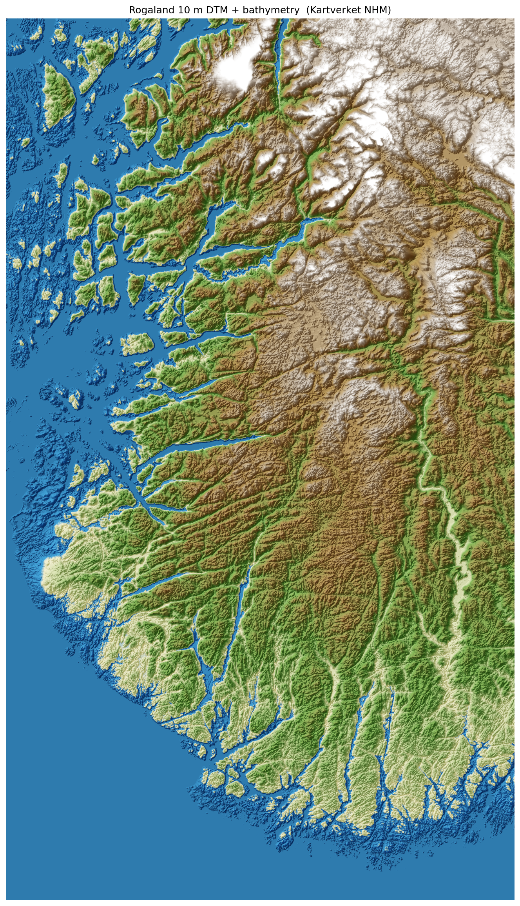

# Rogaland 3D Terrain

A browser-based, real-time 3D renderer of the topography of Rogaland in
south-western Norway, built on a 10-metre digital elevation model from
Kartverket plus OpenStreetMap roads/buildings/boundaries and ESA WorldCover
forest+water layers.



## Quick start

You need:

1. **[uv](https://docs.astral.sh/uv/)** (fast Python runner — handles Python and dependencies for you).
2. **A modern web browser** (Chrome / Edge / Firefox / Safari).

Then:

```bash
git clone https://github.com/gravenimage/norway-terrain.git
cd norway-terrain
uv run serve.py
```

That's it. The script will:
1. Reconstitute the two big data files from `data_parts/` if needed (a few seconds, only happens the first time).
2. Start a local web server on <http://localhost:8000/> (or the next free port if 8000 is busy — the actual URL is printed on startup).
3. Open the viewer in your default browser automatically.

Press **Ctrl+C** in the terminal to stop the server.

### Don't have `uv`?

`uv` is a single-binary install — see <https://docs.astral.sh/uv/getting-started/installation/>.
On Windows / macOS / Linux it's one shell command.

If you really don't want `uv`, plain Python 3.10+ works too:

```bash
python serve.py
```

> **What's the `data_parts/` thing?**
> GitHub blocks single files larger than 100 MB. The 10 m DEM
> (`rogaland_10m.tif`, ~700 MB) and the forest canopy mesh (`canopy.bin`,
> ~110 MB) are stored under `data_parts/` as chunks under 100 MB each.
> `serve.py` (and the standalone `reconstitute.py`) glues them back together
> on first run. Re-running is safe and a no-op.

## What you'll see

Use the mouse to fly around:

- **Left-drag**: orbit
- **Right-drag**: pan
- **Wheel**: zoom

Sliders and toggles in the top-right control panel let you adjust vertical
exaggeration, terrain detail (screen-space error and tessellation), and
which layers are visible (roads, kommune boundaries, buildings, forest,
place labels). Distance sliders fine-tune the LOD switches for buildings
and forest.

The **place labels** toggle shows floating 8-bit-style name tags above
towns, peaks, hills, and named lakes within 2 km of the camera (~30 m
world size, 75 m above the terrain surface). Labels always draw on top of
trees / water / buildings so they stay readable.

A **road-trip panel** in the bottom-right lets you teleport to either end
of the E39 (Mekjarvik or Egersund) and drive between them along the road
at ~70 km/h, with an adjustable camera height (default 75 m). All UI panels
are collapsible — click their headers to fold them out of the way; the state
persists across reloads.

The **Geology** subpanel (top-right) toggles three additional layers — Bedrock,
Quaternary deposits, and Faults — sourced from NGU. Use the blend slider to fade
the geological fills against the natural terrain palette. With any geology layer
visible, click anywhere on the ground to see the rock type and surface deposit
at that point.

## What's in here

| File / folder | What it is |
| --- | --- |
| `viewer.html` | The renderer. Three.js + custom shaders, no build step. |
| `index.html` | A simpler static preview page (PNG renders of the DEM). |
| `serve.py` | One-shot launcher: reconstitutes data + starts the local web server. |
| `reconstitute.py` | Standalone version of just the data-reassembly step. |
| `data_parts/` | Chunked source data files (joined by `reconstitute.py`). |
| `tiles/` | Mapbox-style terrain-RGB pyramid of the DEM (PNG tiles). |
| `forest.bin` | Per-tree seed records (TRE1 binary). |
| `buildings.bin` | OSM building footprints + heights (BLD1 binary). |
| `osm.bin` | Major roads + kommune boundaries (OSM2 binary). |
| `water.bin` | Inland water-body mesh (WATR binary). |
| `e39.bin` | E39 highway centreline between Mekjarvik and Egersund for the road-trip camera (E391 binary). |
| `features.json` | Named towns / peaks / hills / lakes for the place-label sprites. |
| `bedrock_raster.bin` + `bedrock_palette.json` | NGU bedrock raster overlay + palette (BRR1 binary, 50 m px). |
| `quaternary_raster.bin` + `quaternary_palette.json` | NGU Quaternary deposits raster overlay + palette (QRR1 binary, 50 m px). |
| `faults.bin` | NGU structural fault lines (FLT1 binary). |
| `*.py` | Offline data-pipeline scripts (you don't need to run these). |
| `SPEC.md` | Full feature & data-source specification (read this if you want to reimplement the renderer in another stack). |

## Regenerating the data files (advanced)

You don't need to do this — the binaries are committed. But if you ever
want to rebuild from raw sources, the scripts in this folder do that:

- `densify.py` — downloads the 10 m DEM from Kartverket and mosaics it.
- `pyramid.py` — slices the DEM into the terrain-RGB PNG tile pyramid.
- `osm_fetch.py` — pulls major roads + kommune boundaries from Overpass.
- `buildings_fetch.py` — pulls building footprints from Overpass in tiles.
- `forest_polys.py` — builds canopy mesh + per-tree records from ESA
  WorldCover class 10.
- `water_polys.py` — builds the inland-water mesh from WorldCover class 80.
- `extract_e39.py` — pulls the E39 highway centreline from Overpass and
  builds `e39.bin` for the road-trip camera.
- `extract_named_features.py` — pulls named towns, peaks, hills, and lakes
  from Overpass over the Rogaland DEM bbox and writes `features.json` for
  the place-label sprites. Caches the raw Overpass response in
  `features_raw.json`; delete it to force a re-fetch.
- `geology_fetch.py` — pulls NGU bedrock + Quaternary + faults via WFS for the
  Rogaland bbox. Slow (tens of minutes) on first run; caches per-tile responses
  under `geology_cache/`. Requires `pyproj` in addition to the deps above.

Each script requires `numpy`, `rasterio`, `requests` and `shapely`. The
recommended invocation pattern is:

```bash
uv run --with numpy --with rasterio --with requests --with shapely python <script>.py
```

(Or set up a virtualenv yourself.)

## Data sources & licences

- **DEM**: Kartverket "NHM_DTM_TOPOBATHY_25833" (Norwegian National Height
  Model, 1 m → downsampled to 10 m), <https://hoydedata.no>.
  Open data under [Kartverket open data
  terms](https://www.kartverket.no/api-og-data/vilkar-for-bruk).
- **Roads, buildings, kommune boundaries**: OpenStreetMap contributors,
  fetched via the public Overpass API. © OpenStreetMap contributors,
  [ODbL](https://www.openstreetmap.org/copyright).
- **Forest + water cover**: ESA WorldCover v200 2021 product (10 m global
  land cover). © ESA WorldCover project, CC BY 4.0.
- **Geology**: NGU (Norges geologiske undersøkelse), bedrock + Quaternary
  + structural data via the public WFS services. © NGU,
  [CC BY 4.0](https://creativecommons.org/licenses/by/4.0/).

The rendering code in this repository is otherwise free to copy and
adapt. See `SPEC.md` for the full visual / aesthetic specification.

## Client development

The browser client is split into ES modules under `src/client/` and is bootstrapped by `viewer.html`.

Useful checks:

~~~powershell
npm run test:client
npm run test:viewer
npm run test:viewer:visual
uv run --with pytest --with numpy --with rasterio --with pyproj --with requests --with shapely --with mapbox-earcut pytest -q
~~~

Use `docs/client-architecture.md` for module ownership and `docs/client-regression-checklist.md` before merging viewer changes.
